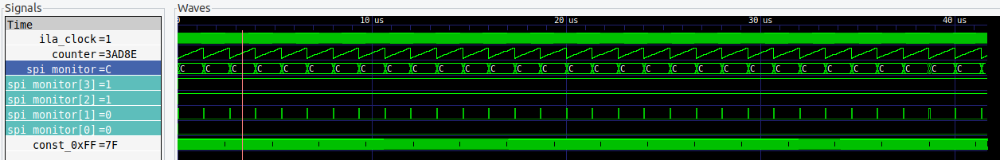

# amtest

This is a collection of my tests written in order to better understand amaranth HDL and FPGA development in general, and some common tools to test external code.

## status

- set up started on 23feb2022. Not yet fully functional.

To use, in the gui go to the `function interface` tab, then press `start` on the fifo test. That will trigger a logic analyser recording, which once it is sent back over wifi, will open a gtkwave viewer with the data. here's an early result! More usage details will be detailed later.
	

## next steps 
..

## later steps
..

# Usage

Using vscode, open the `amaram.code-workspace` file, then use the `build debug` launch shortcuts as named below. See the `code-workspace` file to see the translation into command line arguments, as they al just call `setup.py` with various arguments.

Initially,

1. Make a `mcu_gui_interface.configjson` file following the `.example`.
2. In vscode as a debugging task, run `fpga upload-uart-passthru-binary`. This routes the uart signals to the ulx3s's esp32 microcontroller. Lots of informtion is printed to screen, and success or failure should be indicated
3. Run `mcu reflash-binary` to load the micropython operating system.

Then, and each time changes are made to fpga gateware,

1. Open the fpga test file such as `test3_from_luna_ula`, then run `fpga upload current file`. Alternatively, for fpga development run `fpga simulate current file` or `fpga generate current file`.

Then, and each time changes are made to mcu firmware,

1. Run `mcu update-firmware` to put this project's firmware on it. As demonstrated in `build.py`, this rsync's over the folder of `amaram/tests/ulx3s_gui_test/common/test_common` and the content of `amaram/tests/ulx3s_gui_test/mcu_firmware/source` to the root directory of the microcontroller. This will end by opening a repl window into the microcontroller. It's not as functional as the underlying `rshell` interface which can still be used manually.

Then, and each time changes are made to gui software,

1. Run `start gui` which also acts as the server for the wifi connection, then in the repl window type `import main`, which will start the mcu, which acts as the `client` for the connection. At this point the gui will work as a remote control, providing an interface to read/write spi registers, and to trigger other specific functions.

